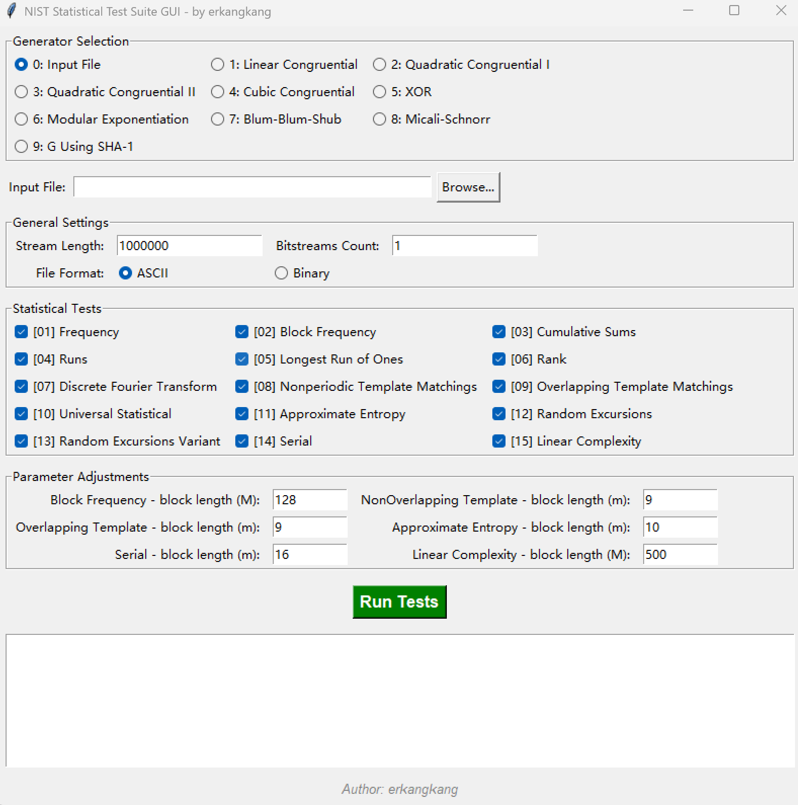

# NIST Statistical Test Suite GUI 

## 项目简介
本项目是美国国家标准与技术研究院（NIST）随机数统计测试套件（Statistical Test Suite, STS）的一个现代化、图形化的封装版本。

原始的 NIST-STS 工具是基于纯 C 语言开发的命令行程序，每次测试都需要进行繁琐的“一问一答”式参数输入。本项目通过 Python `tkinter` 构建了直观的可视化操作界面（GUI），并将核心的测试引擎与运行依赖（如模板文件、目录结构生成逻辑）进行了一体化打包。

用户无需配置复杂的开发环境（不需要安装 GCC、Make 或是 Python），只需运行独立的单一执行文件 `NIST-STS-GUI.exe` 即可在任何 Windows 11 环境下轻松完成随机数的 15 项统计学测试。

## 核心特性
- **开箱即用**：采用 PyInstaller 打包成单文件（One-File），内置底层 `assess.exe` 引擎及所需数据模板，双击即可运行。
- **图形化界面**：支持一键选择测试文件、一键勾选测试项目（如频率测试、游程测试等15项）、直观的参数修改（如Block Length）。
- **智能目录管理**：程序运行时会自动在当前目录生成 NIST 工具必需的 `experiments/` 结果树以及 `templates/` 数据模板文件夹。
- **实时日志反馈**：测试过程的终端日志输出会实时重定向显示在界面的 Log 窗口中，进度一目了然。



## 使用说明

1. **准备数据文件**
   - 准备你需要测试的随机数文件。文件可以是由 `0` 和 `1` 组成的 ASCII 文本文件，也可以是纯二进制（Binary）文件。

2. **运行测试**
   - 双击打开 `NIST-STS-GUI.exe`。
   - **Generator Selection**：默认选择 `[0] Input File`，即外部文件测试。
   - **Input File**：点击 `Browse...` 按钮选中你准备好的数据文件。
   - **General Settings**：
     - **Stream Length**：输入你想要测试的单条位流长度（如 `1000000`）。
     - **Bitstreams Count**：输入你要测试的位流总数量。
     - **File Format**：根据你的文件类型选择 `ASCII` 或是 `Binary`。
   - **Statistical Tests**：勾选你希望运行的统计测试项目（默认全部勾选）。
   - **Parameter Adjustments**：如果有特殊需求，可以调整个别测试的块大小（如 M 或 m）。
   - 点击底部绿色的 **Run Tests** 按钮开始测试。

3. **查看结果**
   - 测试运行完毕后（Log 框显示 `Statistical Testing Complete!!!!!!!!!!!!`），会在 `.exe` 所在的同级目录下生成一个 `experiments` 文件夹。
   - 进入 `experiments/AlgorithmTesting/`，你可以查看所有测试项的 `results.txt` 和 `stats.txt`，以及最终的汇总报告 `finalAnalysisReport.txt`。

## 文件结构说明（源码级）
如果你希望对源码进行二次开发，本目录包含以下主要文件：
- `src/` & `include/`：原始 NIST-STS 工具的 C 语言源代码。
- `makefile`：用于编译 C 代码的 Makefile 脚本（已修改适配 MinGW/GCC）。
- `gui.py`：Python GUI 界面的主控代码。
- `templates/`：NIST-STS 在运行 Non-Overlapping Template 测试时需要加载的模板数据。
- `assess.exe`：由 C 语言编译生成的核心测试程序。

### 如何重新打包？
如果你修改了 `gui.py` 并希望重新生成 `.exe`：
1. 确保已安装 Python 及依赖：`pip install pyinstaller`
2. 在当前目录下打开终端，执行以下命令：
```powershell
pyinstaller --onefile --windowed --add-binary "assess.exe;." --add-data "templates;templates" --name="NIST-STS-GUI" gui.py
```
3. 打包完成后，在 `dist/` 文件夹下提取最新的 `NIST-STS-GUI.exe` 即可。

---
*Author: erkangkang*
